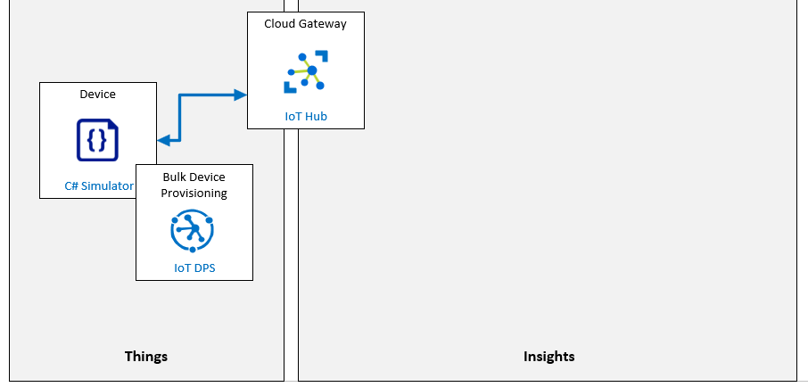

# Individual Enrollment of a Device in DPS

**Inscripción individual de un dispositivo en DPS**
**Escenario de laboratorio**
La administración de Contoso está presionando para que se actualice su solución de seguimiento y monitoreo de activos existente. La actualización utilizará dispositivos de IoT para reducir el trabajo de entrada de datos manual que se requiere en el sistema actual y proporcionar un seguimiento más avanzado durante el proceso de envío. La solución se basa en la capacidad de aprovisionar dispositivos de IoT cuando se cargan los contenedores de envío y desaprovisionar los dispositivos cuando el contenedor llega al destino. La mejor opción para administrar los requisitos de aprovisionamiento parece ser el Servicio de aprovisionamiento de dispositivos (DPS) de IoT Hub.

El sistema propuesto utilizará dispositivos IoT con sensores integrados para rastrear la ubicación, temperatura y presión de los contenedores de envío durante el tránsito. Los dispositivos de IoT se colocarán dentro de los contenedores de envío existentes que Contoso usa para transportar su queso y se conectarán a Azure IoT Hub mediante el WiFi proporcionado por el vehículo. El nuevo sistema proporcionará un monitoreo continuo del entorno del producto y permitirá una variedad de escenarios de notificación cuando se detecten problemas. La velocidad a la que se envía la telemetría a IoT Hub debe ser configurable.

En las instalaciones de envasado de queso de Contoso, cuando un contenedor vacío ingresa al sistema, se equipará con el nuevo dispositivo de IoT y luego se cargará con productos de queso envasados. El dispositivo de IoT se aprovisionará automáticamente al centro de IoT mediante DPS. Cuando el contenedor llega al destino, el dispositivo de IoT se recuperará y se debe desaprovisionar por completo (cancelar y cancelar el registro). Los dispositivos recuperados se reciclarán y reutilizarán para futuros envíos siguiendo el mismo proceso de aprovisionamiento automático.

Se le ha asignado la tarea de validar el proceso de aprovisionamiento y desaprovisionamiento del dispositivo mediante DPS. Para la fase de prueba inicial, utilizará un enfoque de inscripción individual.

Se crearán los siguientes recursos:



## En este laboratorio

En este laboratorio, comenzará por revisar los requisitos previos del laboratorio y ejecutará un script si es necesario para asegurarse de que su suscripción de Azure incluye los recursos necesarios. Luego, creará una nueva inscripción individual en DPS que utiliza la atestación de clave simétrica y especifica un Device Twin State inicial (tasa de telemetría) para el dispositivo. Con la inscripción del dispositivo guardada, volverá a la inscripción y obtendrá las claves primaria y secundaria generadas automáticamente que se necesitan para la certificación del dispositivo. A continuación, crea un dispositivo simulado y verifica que el dispositivo se conecte correctamente con IoT Hub y que el dispositivo aplique las propiedades iniciales del dispositivo gemelo como se esperaba. Para finalizar, completará un proceso de desaprovisionamiento que elimina de forma segura el dispositivo de su solución dando de baja  y cancelando el registro del dispositivo (de "Device Provisioning Service" DPS e IoT hub respectivamente). 

El laboratorio incluye los siguientes ejercicios:

- Verificar los requisitos previos del laboratorio
- Cree una nueva inscripción individual (claves simétricas) en DPS
- Configurar dispositivo simulado
- Pruebe el dispositivo simulado
- Dar de baja el dispositivo

[back](../Readme.md)


Primary Key

```

```

Secondary key

```

```


DPS - Id Scope

```

```

