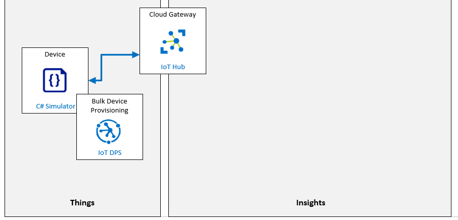

# Automatically provision IoT devices securely and at scale with DPS

**Aprovisione automáticamente dispositivos de IoT de forma segura y a escala con DPS**
**Escenario de laboratorio**
Su trabajo hasta la fecha en la solución de seguimiento y monitoreo de activos de Contoso le ha permitido validar el proceso de aprovisionamiento y desaprovisionamiento de dispositivos mediante un enfoque de inscripción individual. El equipo de administración ahora le ha pedido que comience a probar el proceso para una implementación a mayor escala.

Para que el proyecto siga avanzando, debe demostrar que el servicio de aprovisionamiento de dispositivos se puede utilizar para inscribir un mayor número de dispositivos de forma automática y segura mediante la autenticación de certificado X.509. Estará configurando una inscripción grupal para verificar que se cumplan los requisitos de Contoso.

Se crearán los siguientes recursos:



## En este laboratorio

En este laboratorio, comenzará por revisar los requisitos previos del laboratorio y ejecutará un script si es necesario para asegurarse de que su suscripción de Azure incluye los recursos necesarios. Luego, generará un certificado de CA raíz X.509 usando OpenSSL dentro de Azure Cloud Shell y usará el certificado raíz para configurar la inscripción de grupo dentro del servicio de aprovisionamiento de dispositivos (DPS). Después de eso, usará el certificado raíz para generar un certificado de dispositivo, que usará dentro de un código de dispositivo simulado para aprovisionar su dispositivo a IoT Hub. Mientras esté en el código de su dispositivo, implementará el acceso a las propiedades del dispositivo gemelo que se utilizan para realizar la configuración inicial del dispositivo. Luego probará su dispositivo simulado. Para finalizar este laboratorio, desaprovisionará toda la inscripción del grupo. 

El laboratorio incluye los siguientes ejercicios:

- Verificar los requisitos previos del laboratorio
- Genere y configure certificados de CA X.509 usando OpenSSL
- Configurar dispositivo simulado con certificado X.509
- Pruebe el dispositivo simulado
- Dar de baja una inscripción de grupo

[back](../Readme.md)

Certificate validation code

```

```

ID Scope for Device Provisioning Service

```

```

