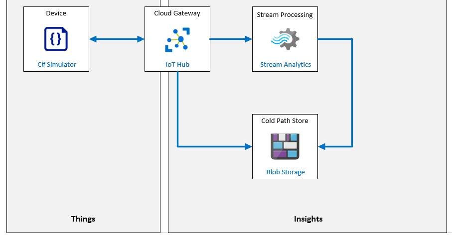

# Device Message Routing

**Escenario de laboratorio**
Contoso Management está impresionado con su implementación de la inscripción automática de dispositivos mediante DPS. Ahora están interesados en que desarrolle una solución basada en IoT relacionada con el embalaje y envío de productos.

El costo asociado con el envasado y envío del queso es significativo. Para maximizar la rentabilidad, Contoso opera una instalación de empaque en las instalaciones. El flujo de trabajo es sencillo: el queso se corta y empaqueta, los paquetes se ensamblan en contenedores de envío, los contenedores se entregan en contenedores específicos asociados con su destino. Se utiliza un sistema de cinta transportadora para mover el producto a través de este proceso. La métrica del éxito es la cantidad de paquetes que salen del sistema de cinta transportadora durante un período de tiempo determinado (normalmente un turno de trabajo).

El sistema de cinta transportadora es un eslabón crítico en este proceso y se monitoriza visualmente para garantizar que el flujo de trabajo progrese con la máxima eficiencia. El sistema tiene tres velocidades controladas por el operador: detenido, lento y rápido. Naturalmente, el número de paquetes que se entregan a baja velocidad es menor que a alta velocidad. Sin embargo, hay otros factores a considerar:

- El nivel de vibración del sistema de cinta transportadora es mucho menor a baja velocidad.

- Los altos niveles de vibración pueden hacer que los paquetes se caigan del transportador.
- Se sabe que los altos niveles de vibración aceleran el desgaste del sistema.
- cuando los niveles de vibración exceden un límite de umbral, la cinta transportadora debe detenerse para permitir la inspección (para evitar fallas más graves)

Además de maximizar el rendimiento, su solución de IoT automatizada implementará una forma de mantenimiento preventivo basado en los niveles de vibración, que se utilizará para detectar señales de advertencia tempranas antes de que se produzcan daños graves en el sistema.

> Nota: El mantenimiento preventivo (a veces llamado mantenimiento preventivo o mantenimiento predictivo) es un programa de mantenimiento del equipo que programa las actividades de mantenimiento que se realizarán mientras el equipo está funcionando normalmente. La intención de este enfoque es evitar averías inesperadas que a menudo conllevan costosas interrupciones.

No siempre es fácil para un operador detectar visualmente niveles anormales de vibración. Por este motivo, está buscando una solución de Azure IoT que le ayudará a medir los niveles de vibración y las anomalías de los datos. Los sensores de vibración se conectarán a la cinta transportadora en varios lugares, y utilizará dispositivos de IoT para enviar telemetría al IoT Hub. El IoT Hub utilizará Azure Stream Analytics y un modelo integrado de aprendizaje automático (ML) para alertarlo sobre anomalías de vibración en tiempo real. También planea archivar todos los datos de telemetría para que los modelos internos de aprendizaje automático se puedan desarrollar en el futuro.

Decide crear un prototipo de la solución mediante telemetría simulada desde un único dispositivo de IoT.

Para simular los datos de vibración de una manera realista, trabaje con un ingeniero de Operaciones para comprender un poco las causas de las vibraciones. Resulta que hay varios tipos diferentes de vibración que contribuyen al nivel general de vibración. Por ejemplo, una "fuerza de vibración" podría ser introducida por una rueda guía rota o una carga especialmente pesada colocada incorrectamente en la cinta transportadora. También hay una "vibración creciente", que se puede introducir cuando se excede un límite de diseño del sistema (como la velocidad o el peso). El equipo de ingeniería acepta ayudarlo a desarrollar el código para un dispositivo de IoT simulado que producirá una representación aceptable de los datos de vibración (incluidas las anomalías).

Se crearán los siguientes recursos:



## En este laboratorio

En este laboratorio, comenzará por revisar los requisitos previos del laboratorio y ejecutará un script si es necesario para asegurarse de que su suscripción de Azure incluye los recursos necesarios. Luego, creará un dispositivo simulado que envía telemetría de vibración a su centro de IoT. 

Una vez que los datos simulados lleguen a IoT hub, implementará una ruta de mensajes de IoT Hub y un trabajo de Azure Stream Analytics que se puede usar para archivar datos. 

El laboratorio incluye los siguientes ejercicios:

- Verificar los requisitos previos del laboratorio
- Se utilizará un script para crear los recursos que falten y una nueva identidad de dispositivo (sensor-v-3000) para este laboratorio.
- Escribir código para generar telemetría de vibración
- Crear una ruta de mensajes a Azure Blob Storage
- Ruta de registro Trabajo de Azure Stream Analytics


[back](../Readme.md)

Device Connection String for the application

```

```

