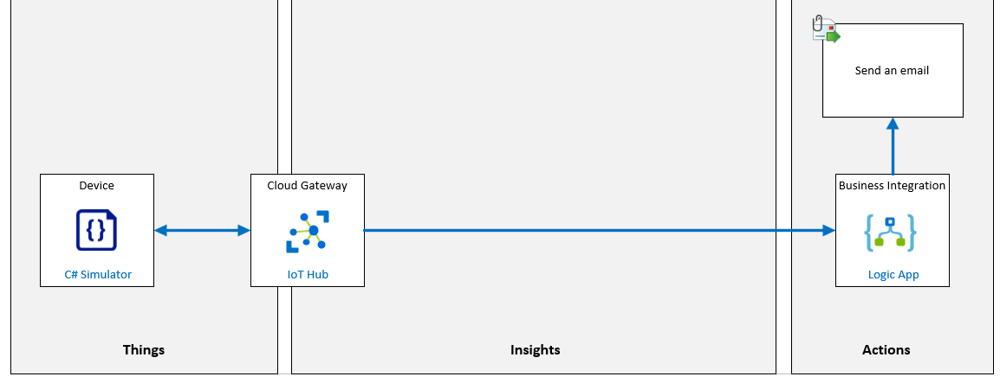

# Integrate IoT Hub with Event Grid

**Integrar IoT Hub con Event Grid**

## Escenario de laboratorio

La administración de Contoso está impresionada con las soluciones prototipo que ha creado con los servicios de Azure IoT y se sienten cómodos asignando un presupuesto adicional a las capacidades que ya ha demostrado. Ahora le piden que explore la integración de ciertas capacidades de soporte operativo. Específicamente, les gustaría ver cómo las herramientas de Azure admiten el envío de notificaciones de alerta a los gerentes que son responsables de áreas de trabajo específicas. Los criterios de alerta serán definidos por los responsables del área de negocio. Los datos de telemetría que lleguen al IoT Hub se evaluarán para generar las notificaciones.

Ha identificado a una gerente comercial, Nancy, con la que ha trabajado con éxito en el pasado. Trabajará con ella durante la fase inicial de su solución.

Nancy le informa que su equipo de técnicos de las instalaciones es responsable de instalar los nuevos termostatos conectados que se utilizarán para monitorear la temperatura en diferentes cuevas de queso. Los dispositivos de termostato funcionan como dispositivos de IoT que se pueden conectar al IoT Hub. Para que su proyecto comience, acepta crear una alerta que generará una notificación cuando se implemente un nuevo dispositivo.

Para generar una alerta, enviará un tipo de evento creado por dispositivo a Event Grid cuando se cree un nuevo dispositivo de termostato en IoT Hub. Creará una instancia de Logic Apps que reacciona a este evento (en Event Grid) y que enviará un correo electrónico para alertar a las instalaciones cuando se haya creado un nuevo dispositivo, especificando el ID del dispositivo y el estado de conexión.

Se crearán los siguientes recursos:



## En este laboratorio

**En este laboratorio, completará las siguientes actividades:**

- Verifique que se cumplan los requisitos previos del laboratorio (que tenga los recursos de Azure necesarios)
- Cree una lógic app  que envíe un correo electrónico
- Configurar una suscripción a eventos de Azure IoT Hub
- Cree nuevos dispositivos para activar la lógic app

[back](../Readme.md)


URL Http Trigger of Logic App

```

```

