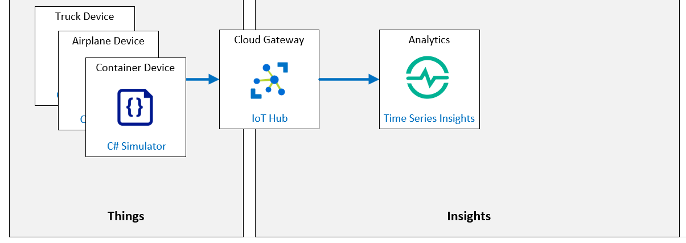

# Explore and analyze time stamped data with Time Series Insights

**Escenario de laboratorio**
Su arduo trabajo implementando los servicios y herramientas de Azure IoT ha valido la pena. Contoso ha implementado su “Sistema de seguimiento de la condición de los activos” que monitorea las condiciones ambientales de los contenedores de queso durante el envío.

Dos semanas después del lanzamiento del nuevo sistema, ha revelado un aumento de temperatura en tránsito para un envío específico. Parte del queso del envío se arruinó, pero el nuevo sistema aseguró que el queso afectado no se entregara al cliente. Como conoce el lado de Azure IoT del sistema de monitoreo mejor que nadie, liderará la investigación.

La gerencia le ha pedido que determine si el sistema se puede mejorar, con suerte hasta el punto en que evitará la pérdida de producto en el futuro. Usted correlaciona los datos de los sensores de los dispositivos de IoT tomados de los camiones y aviones utilizados durante el envío. Parece que la temperatura en uno de los camiones aumentó inesperadamente en un área particular del vehículo y creó el pico de calor en uno de los contenedores de transporte (que estaba equipado con un dispositivo IoT que monitorea la temperatura y la humedad).

Su equipo decide que las mejoras adicionales al sistema de monitoreo requerirán una exploración de datos casi en tiempo real y un análisis de la causa raíz.

Propone agregar un Time Series Insights a la solución Azure IoT. Esto permitirá a Contoso almacenar, visualizar y consultar rápidamente las grandes cantidades de datos de series temporales que generan los dispositivos de IoT en camiones, aviones y contenedores, y visualizar los cambios a lo largo del tiempo.

**Se crearán los siguientes recursos:**



## En este laboratorio

En este laboratorio, completará las siguientes actividades:

- Verifique que se cumplan los requisitos previos del laboratorio (que tenga los recursos de Azure necesarios)

- El script creará un IoT Hub si es necesario.
- El script creará tres nuevas identidades de dispositivo para este laboratorio.
- Crear un entorno de Azure Time Series Insights (TSI)
- Conéctese a IoT Hub con Time Series Insights (TSI)
- Ver datos de series de tiempo con el Explorador de Time Series Insights (TSI)

[back](../Readme.md)


Device connection string for the application

```

```

