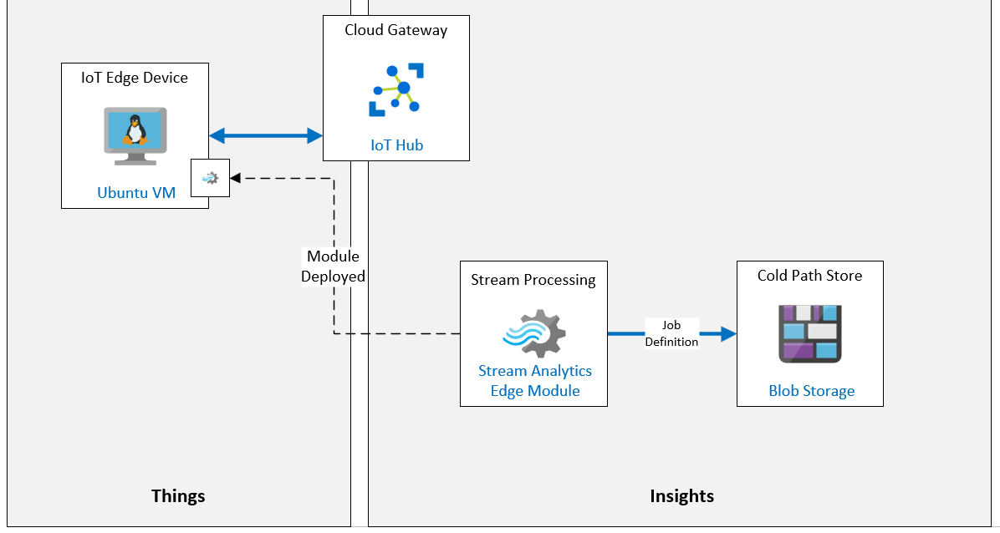

# Introduction to Azure IoT Edge

**Introducción a Azure IoT Edge**

## Escenario de laboratorio

Para alentar a los consumidores locales en un mercado global, Contoso se ha asociado con artesanos locales para producir queso en nuevas regiones del mundo.

Cada ubicación admite múltiples líneas de producción que están equipadas con las máquinas mezcladoras y procesadoras que se utilizan para crear los quesos locales. Actualmente, las instalaciones cuentan con dispositivos IoT conectados a cada máquina. Estos dispositivos transmiten los datos del sensor a Azure y todos los datos se procesan en la nube.

Debido a la gran cantidad de datos que se recopilan y al tiempo de respuesta urgente que se necesita en algunas de las máquinas, Contoso quiere usar un dispositivo de puerta de enlace IoT Edge para llevar parte de la inteligencia al Edge para su procesamiento inmediato. Una parte de los datos aún se enviará a la nube. Llevar la inteligencia de datos a IoT Edge también garantiza que podrán procesar datos y reaccionar rápidamente incluso si la red local es deficiente.

Se le ha encomendado la tarea de crear un prototipo de la solución Azure IoT Edge. Para comenzar, configurará un dispositivo IoT Edge que monitorea la temperatura (simulando un dispositivo conectado a una de las máquinas procesadoras de queso). Luego, implementará un módulo Stream Analytics en el dispositivo que se usará para calcular la temperatura promedio y generará una notificación de alerta si se exceden los valores de control del proceso.

Se crearán los siguientes recursos:



## En este laboratorio

**En este laboratorio, completará las siguientes actividades:**

- Verifique que se cumplan los requisitos previos del laboratorio (que tenga los recursos de Azure necesarios)
- Implementar una máquina virtual Linux habilitada para Azure IoT Edge
- Crear una IoT Edge Device Identity en IoT Hub mediante la CLI de Azure
- Conecte el dispositivo IoT Edge a IoT Hub
- Agregar un Edge Module a un the Edge Device
- Implemente Azure Stream Analytics como un módulo de IoT Edge

[back](../Readme.md)

**IoT Sensor** sensor-th-0067 connection string on MV IoTEdge config

```

```


