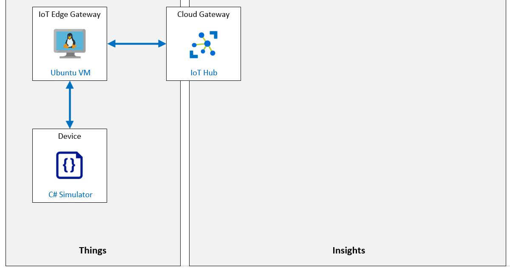

# Run an IoT Edge device in restricted network and offline

**Ejecutar un dispositivo IoT Edge en una red restringida y sin conexión**

## Escenario de laboratorio

El sistema de supervisión de la cinta transportadora que implementó en las instalaciones de envasado y envío de queso de Contoso está dando sus frutos. El sistema ahora envía datos de telemetría a Azure IoT Hub que ayuda a las operaciones a administrar los niveles de vibración de las correas, y los nuevos dispositivos IoT Edge ayudan a administrar el inventario mediante el seguimiento de la cantidad de paquetes de queso que pasan por el sistema.

Su gerente quiere que el sistema sea resistente a las interrupciones de la red, que aún ocurren ocasionalmente en algunas áreas de las instalaciones de procesamiento de queso. Además, el departamento de TI ha solicitado que optimice el sistema para cargar de forma masiva cualquier dato de telemetría no crítico en momentos específicos del día para ayudar a equilibrar la carga del uso de la red.

Propone configurar IoT Edge para admitir un escenario fuera de línea en caso de que la red se caiga, y considerará almacenar la telemetría de los sensores localmente (en el dispositivo) y configurar los dispositivos Edge para sincronizaciones regulares en momentos determinados.

**Se crearán los siguientes recursos:**



## En este laboratorio

**En este laboratorio, completará las siguientes actividades:**

- Verifique que se cumplan los requisitos previos del laboratorio (que tenga los recursos de Azure necesarios)

- El script creará un IoT Hub si es necesario.
- El script creará una nueva identidad de dispositivo necesaria para este laboratorio.
- Implementar una máquina virtual Linux habilitada para Azure IoT Edge
- Configurar un dispositivo principal de IoT Edge con un dispositivo de IoT hijo
- Configurar el dispositivo IoT Edge como puerta de enlace
- Abrir los puertos de entrada del dispositivo IoT Edge Gateway mediante la CLI de Azure
- Configurar el tiempo de vida y el almacén de mensajes del dispositivo IoT Edge Gateway
- Conectar el dispositivo Child IoT a IoT Edge Gateway
- Probar la conectividad del dispositivo y el soporte fuera de línea

[back](../Readme.md)

Connection String 

```

```

Password for vm

```
P455w0rd.rd2022
```

Device connection string

```

```

Device Primary Key

```

```

Public FQDN

```

```

Public SSH

```

```


Gateway connection string

```

```

