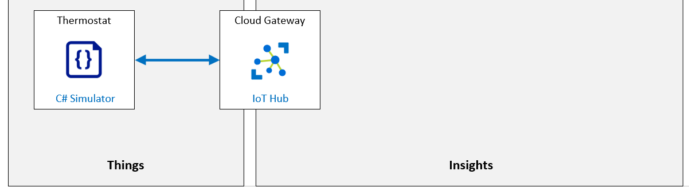

# Automate IoT Device Management with Azure IoT Hub

Los dispositivos de IoT a menudo utilizan sistemas operativos optimizados o incluso ejecutan código directamente en el silicio (sin la necesidad de un sistema operativo real). Para actualizar el software que se ejecuta en dispositivos como estos, el método más común es actualizar una nueva versión de todo el paquete de software, incluido el sistema operativo y las aplicaciones que se ejecutan en él (llamado firmware).

Debido a que cada dispositivo tiene un propósito específico, su firmware también es muy específico y está optimizado para el propósito del dispositivo, así como para los recursos limitados disponibles.

El proceso de actualización del firmware también puede ser específico del hardware y de la forma en que el fabricante del hardware creó la placa. Esto significa que una parte del proceso de actualización del firmware no es genérico y deberá trabajar con el fabricante de su dispositivo para obtener los detalles del proceso de actualización del firmware (a menos que esté desarrollando su propio hardware, lo que significa que probablemente sepa cuál es el proceso de actualización del firmware). 

Si bien las actualizaciones de firmware solían aplicarse manualmente en dispositivos individuales, esta práctica ya no tiene sentido considerando la cantidad de dispositivos utilizados en las soluciones típicas de IoT. Las actualizaciones de firmware ahora se realizan más comúnmente por aire (over-the-air OTA) con implementaciones de nuevo firmware administradas de forma remota desde la nube.

Existe un conjunto de denominadores comunes para todas las actualizaciones de firmware inalámbricas para dispositivos IoT:

1. Las versiones de firmware se identifican de forma única

2. El firmware viene en un formato de archivo binario que el dispositivo deberá adquirir de una fuente en línea
3. El firmware se almacena localmente es alguna forma de almacenamiento físico (memoria ROM, disco duro,…)
4. El fabricante del dispositivo proporciona una descripción de las operaciones necesarias en el dispositivo para actualizar el firmware.

Azure IoT Hub ofrece soporte avanzado para implementar operaciones de administración de dispositivos en dispositivos individuales y en colecciones de dispositivos. La función de administración automática de dispositivos le permite configurar simplemente un conjunto de operaciones, activarlas y luego monitorear su progreso.

**Escenario de laboratorio**
El sistema de procesamiento de aire automatizado que implementó en las cuevas de queso de Contoso ha ayudado a la empresa a elevar su nivel de alta calidad. La empresa tiene más quesos galardonados que nunca.

Su solución base consta de dispositivos IoT que están integrados con sensores y un sistema de control climático para proporcionar control en tiempo real de la temperatura y la humedad dentro de un sistema de cuevas de múltiples cámaras. También desarrolló una aplicación de back-end simple que demostró la capacidad de administrar dispositivos utilizando métodos directos y propiedades de dispositivos gemelos.

Contoso ha ampliado la aplicación de back-end simple de su solución inicial para incluir un portal en línea que los operadores pueden usar para monitorizar y administrar de forma remota el entorno de la cueva. Con el nuevo portal, los operadores pueden incluso personalizar la temperatura y la humedad dentro de la cueva según el tipo de queso o para una fase específica dentro del proceso de envejecimiento del queso. Cada cámara o zona dentro de la cueva se puede controlar por separado.

El departamento de TI mantendrá el portal de back-end que desarrollaron para los operadores, pero su gerente acordó administrar el lado del dispositivo de la solución.

Para usted, esto significa dos cosas:

1. El equipo de operaciones de Contoso siempre está buscando formas de realizar mejoras. Estas mejoras a menudo conducen a solicitudes de nuevas funciones en el software del dispositivo.

2. Los dispositivos de IoT que se implementan en ubicaciones de cuevas necesitan los últimos parches de seguridad para garantizar la privacidad y evitar que los piratas informáticos tomen el control del sistema. Para mantener la seguridad del sistema, debe mantener los dispositivos actualizados actualizando su firmware de forma remota.


Usted planea implementar funciones de IoT Hub que permitan la administración automática de dispositivos y la administración de dispositivos a escala.

Se crearán los siguientes recursos:



**En este laboratorio**
En este laboratorio, completará las siguientes actividades:

- Verifique que se cumplan los requisitos previos del laboratorio (que tenga los recursos de Azure necesarios)
- Escriba el código para un dispositivo simulado que implementará una actualización de firmware
- Pruebe el proceso de actualización de firmware en un solo dispositivo mediante la administración automática de dispositivos de Azure IoT Hub

[back](../Readme.md)

ConnectionString

```

```

deviceConnectionString

```

```

devicePrimaryKey

```

```

