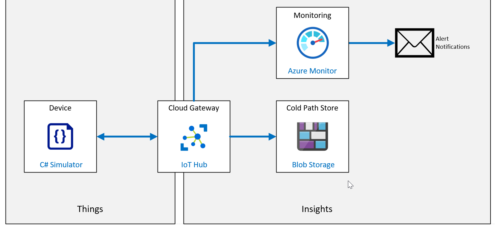

# How to manage your Azure IoT Hub

Cómo administrar su Azure IoT Hub

**Escenario de laboratorio**

La solución de seguimiento y supervisión de activos de Contoso funciona a la perfección. El sistema proporciona un seguimiento continuo durante todo el proceso de embalaje y envío. Ha implementado inscripciones grupales dentro de DPS para aprovisionar dispositivos a escala, y cuando el contenedor llega al destino, el dispositivo de IoT se "da de baja" a través de DPS para que pueda reutilizarse para envíos futuros.

Para ayudar a administrar la utilización del dispositivo y otras características de la solución, el departamento de TI le ha pedido a su equipo que implemente los servicios de registro y monitorización de Azure dentro de la solución de IoT.

Acepta comenzar implementando algunas métricas simples que pueden revisarse con el personal de TI antes de comprometerse con cualquier carga de trabajo adicional.

En esta práctica de laboratorio, implementará la monitorización para rastrear la cantidad de dispositivos conectados, la cantidad de mensajes de telemetría enviados y también enviará eventos de conexión a un registro. Además, creará una alerta que se activará cuando la cantidad de dispositivos conectados supere un límite de umbral. Para probar el sistema, conectará un solo dispositivo y transmitirá la telemetría, luego desconectará el dispositivo para generar una alerta.

Se crearán los siguientes recursos:



**En este laboratorio**
En este laboratorio, completará las siguientes actividades:

- Configurar los requisitos previos del laboratorio (recursos de Azure necesarios)
- Descargue y ejecute una aplicación que simule un dispositivo IoT que envía mensajes al hub.
- Ejecute la aplicación para generar telemetría.
- Habilite los registros de diagnóstico.
- Habilitar métricas.
- Configure alertas para esas métricas.
- Salga de la aplicación para generar una alerta.
- Observe las métricas y verifique los registros de diagnóstico..
- [back](../Readme.md)


- connectionString IoTHub

  ```
  
  ```

  

- deviceConnectionString sensor-thl-2001

  ```
  
  ```

  

- devicePrimaryKey sensor-thl-2001

  ```
  
  ```

  

- storageAccountName til 23 characters in name **TIP**

  ```
  staz220tr{YourID}
  ```

  
