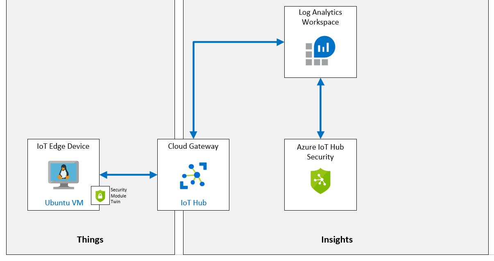

# Detect Device Tampering with Azure Defender for IoT

**Detecte la manipulación de dispositivos con Azure Defender para IoT**

## Escenario de laboratorio

Contoso ha construido todas sus soluciones pensando en la seguridad. Sin embargo, quieren ver cómo pueden obtener una vista unificada de la seguridad en todas sus cargas de trabajo locales y en la nube, incluidas sus soluciones de Azure IoT. Además, al incorporar nuevos dispositivos, la empresa desea aplicar políticas de seguridad en todas las cargas de trabajo (dispositivos Leaf, dispositivos Microsoft Edge, IoT Hub) para garantizar el cumplimiento de los estándares de seguridad y una postura de seguridad mejorada.

Contoso está agregando una nueva línea de ensamblaje equipada con nuevos dispositivos de IoT para ayudar con las crecientes demandas de envío y empaque de nuevos pedidos. Desea asegurarse de que todos los dispositivos nuevos estén protegidos y también desea poder ver recomendaciones de seguridad que podrían ayudarlo a continuar mejorando la seguridad de su solución (considerando la solución completa de IoT de extremo a extremo). Comenzará a investigar el uso de Azure IoT Center for IoT para su solución.

Contoso también está instalando nuevos termostatos conectados que mejorarán la capacidad de monitorizar y controlar la temperatura en diferentes cuevas de queso. Como parte de los requisitos de seguridad de Contoso, creará una alerta personalizada para monitorear si los termostatos exceden la frecuencia de transmisión de telemetría esperada.

**Se crearán los siguientes recursos:**



> SUGERENCIA: Azure Defender para IoT se denominaba anteriormente Centro de seguridad de Azure para IoT. Puede encontrar algunas inconsistencias en la documentación en línea, los recursos de GitHub y en este contenido debido a la implementación gradual del cambio de nombre.
>

## En este laboratorio

En este laboratorio, completará las siguientes actividades:

- Verifique que se cumplan los requisitos previos del laboratorio (que tenga los recursos de Azure necesarios)

- El script creará un IoT Hub si es necesario
- Habilitar Azure Defender para IoT
- Crear y registrar un nuevo dispositivo
- Crear un módulo de seguridad gemelo
- Instalar Security Agent basado en C # en un dispositivo Linux
- Configurar recursos monitoreados
- Crea alertas personalizadas
- Cree una aplicación de consola para activar la alerta
- Revise la alerta en Azure Defender para IoT

[back](../Readme.md)

VM Admin password:

```
P455w0rd.rd2022
```

VM admin user:

```
manager
```

public FQDN

```

```

public SSH

```

```

Device VM Primary Key

```

```

HostName:

```

```

Primary Connection String sensor-th-0070

```

```

