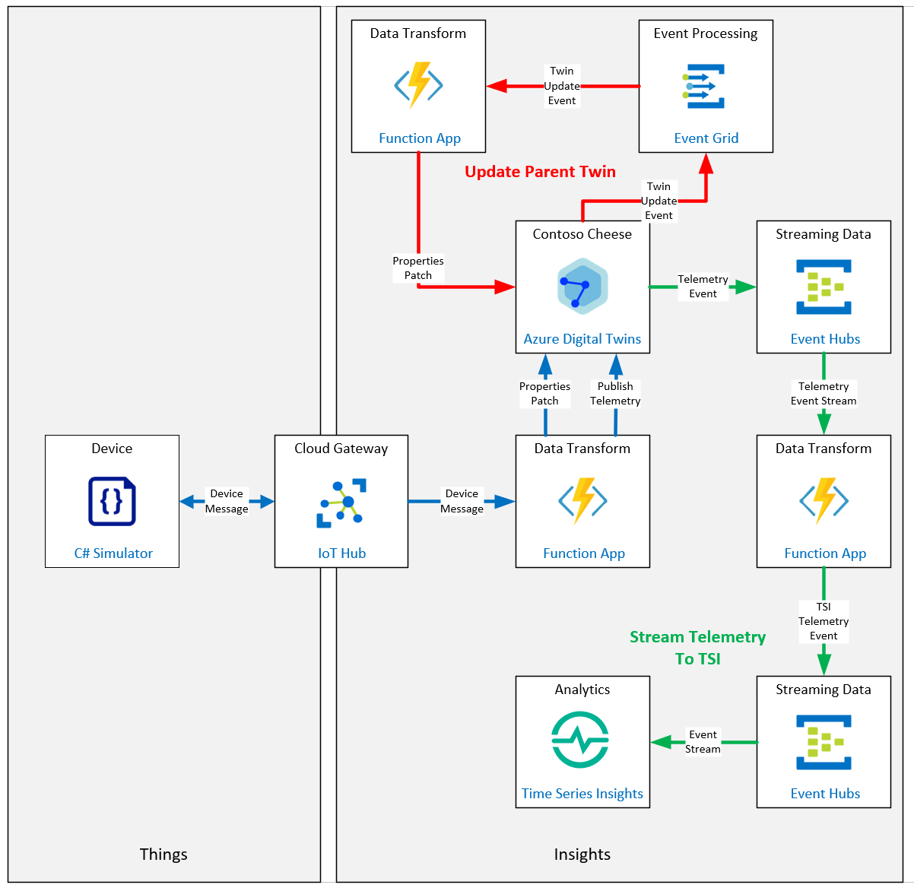

# Develop Azure Digital Twins (ADT) solutions

**Desarrollar soluciones Azure Digital Twins (ADT)**

## Escenario de laboratorio

Contoso Management ha decidido dar el siguiente paso en su evolución digital y desarrollar un modelo de su instalación de fabricación de queso utilizando Azure Digital Twins (ADT). Con Azure Digital Twins, es posible crear e interactuar con modelos en vivo de entornos del mundo real. Primero, cada elemento individual se modela como un gemelo digital. Luego, estos modelos se conectan a un gráfico de conocimiento que puede responder a eventos en vivo y ser consultado para obtener información.

Para comprender mejor cómo aprovechar mejor el ADT, se le ha pedido que cree un prototipo de prueba de concepto que demuestre cómo la telemetría del sensor del dispositivo Cheese Cave existente se puede incorporar en una jerarquía de modelo simple:

- Fábrica de quesos
- Cueva del queso
- Dispositivo de la cueva del queso

**En este primer prototipo, se le ha pedido que demuestre las soluciones a los siguientes escenarios:**

- Cómo se puede asignar la telemetría del dispositivo desde un IoT Hub al dispositivo apropiado en ADT
- Cómo se pueden utilizar las actualizaciones de una propiedad de gemelo digital secundario para actualizar una propiedad de gemelo principal (de un dispositivo Cheese Cave a Cheese Cave)
- Cómo se puede enrutar la telemetría del dispositivo a través de ADT a Time Series Insights

**Se crearán los siguientes recursos:**



## En este laboratorio

**En este laboratorio, completará las siguientes actividades:**

- Verifique que se cumplan los requisitos previos del laboratorio (que tenga los recursos de Azure necesarios)
- Diseñar y desarrollar modelos de gemelos digitales
- Crear y configurar una instancia de Azure Digital Twin (ADT)
- Asignar datos de dispositivos de IoT a modelos y relaciones de ADT
- Cree modelos de gemelos digitales y valide modelos
- Crea y configura gemelos digitales
  - Cree un gemelo digital utilizando DTDL
  - Cree un gráfico ADT utilizando instancias de gemelos digitales

- Implementar interacciones de gráficos ADT (ADT Explorer)
  - Instale y ejecute ADT Explorer
  - Consultar el gráfico ADT
  - Actualizar las propiedades de las entidades ADT en el gráfico

- Integre ADT con sistemas ascendentes y descendentes
  - Ingesta mensajes de dispositivos de IoT y traduce mensajes a ADT
  - Configure las rutas y los puntos finales de ADT para publicar la telemetría en Time Series Insights (TSI)


[back](../Readme.md)

connectionString

```

```


deviceConnectionString

```

```


devicePrimaryKey

```

```


storageAccountName

```

```

Azure Digital Twin Host Name

```

```

Content **adt-connection.txt** file

```

```

Patch information cheese factory - interface model adt:

```

```

 Adding relationships

```

```

Principal ID associate to Azure Function

```

```

Event Hubs Instance Connection string primary key:

```

```

Second Connection String primary key:

```

```

***

**On Lab**

- connectionString

  ```
  HostName=iot-az220-training-bm1502.azure-devices.net;SharedAccessKeyName=iothubowner;SharedAccessKey=C3QpV7LSjkBZX5AJZC2iIwWYebeKyi9YDCiiZZjd2YM=
  ```

  

- deviceConnectionString

  ```
  HostName=iot-az220-training-bm1502.azure-devices.net;DeviceId=sensor-th-0055;SharedAccessKey=FvsGzZvIVLbLbMXNpWtZIRWu+IJ67ZP07DQtL4/Mc+Q=
  ```

  

- devicePrimaryKey

  ```
  FvsGzZvIVLbLbMXNpWtZIRWu+IJ67ZP07DQtL4/Mc+Q=
  ```

  

- storageAccountName

  ```
  staaz220trainingbm1502
  ```


Azure Digital Twin Host Name

```
dt-az220-training-bm220215.api.weu.digitaltwins.azure.net
```

Content **adt-connection.txt** file

```
https://dt-az220-training-bm220215.api.weu.digitaltwins.azure.net
```

Patch information cheese factory - interface model adt:

```
[
  {
    "op": "add",
    "path": "/FactoryName",
    "value": "Cheese Factory 2"
  }
]
```


 Adding relationships

```
az dt twin relationship create -n dt-az220-training-bm220215 --relationship-id factory_1_has_cave_1 --relationship rel_has_caves --twin-id factory_1 --target cave_1
```

Principal ID associate to Azure Function

```
7408acc3-e75b-4048-b076-d4bd77b6c437
```

Event Hubs Instance Connection string primary key:

```
Endpoint=sb://evhns-az220-training-bm1502.servicebus.windows.net/;SharedAccessKeyName=ADTHubPolicy;SharedAccessKey=RKIilOHfR5yqrmRrnFrabHQhPaKrWqwyLtEraoUqCcw=;EntityPath=evh-az220-adt2func
```

Secondary Connection String primary key:

```
Endpoint=sb://evhns-az220-training-bm1502.servicebus.windows.net/;SharedAccessKeyName=TSIHubPolicy;SharedAccessKey=aRIXD67rhvlyK8M8F4f4f8r0p21Yc0YUe/IprAB92V8=;EntityPath=evh-az220-func2tsi
```

