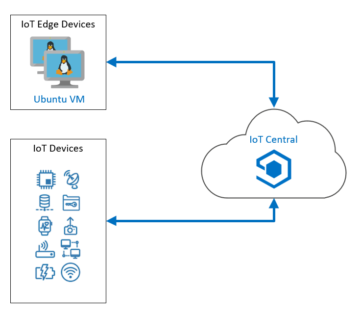

# Create your first Azure IoT Central App

## Cree su primera aplicación Azure IoT Central

Los servicios y tecnologías de Azure IoT funcionan muy bien y son fáciles de administrar cuando se cuenta con el equipo de personas, pero una arquitectura de solución de IoT completa puede ser mucho para que un equipo pequeño y menos especializado pueda implementar y brindar soporte. Azure IoT Central es una aplicación SaaS que abarca una gama completa de tecnologías de IoT subyacentes, que incluyen Azure IoT Hub, Azure Device Provisioning System (DPS), Azure Maps, Azure Time Series Insights, Azure IoT Edge y otros. Aunque IoT Central no proporciona el nivel de granularidad que obtiene cuando implementa estas tecnologías directamente, permite a un equipo más pequeño administrar y monitorear fácilmente una flota de dispositivos remotos.

Entre otras cosas, este laboratorio lo ayudará a decidir cuándo IoT Central es la herramienta adecuada para respaldar un escenario en particular. Entonces, prepárese para explorar lo que puede hacer IoT Central.

## Escenario de laboratorio

Contoso opera una flota de camiones refrigerados que se utilizan para entregar queso dentro de una ciudad y sus alrededores. Tiene una gran cantidad de clientes en la región y utiliza una ubicación centralizada en la ciudad para operar la flota. Cada día, los camiones se cargan con productos y el despachador le da al conductor una ruta de entrega. El sistema funciona muy bien y rara vez hay problemas. Sin embargo, si el sistema de enfriamiento de un camión falla, los conductores y el despachador deben discutir cuál es la mejor manera de proceder. El despachador hará que los productos sean devueltos al almacén para su inspección o entregados a una ubicación del cliente que esté cerca de la ubicación actual del vehículo. La cantidad de producto que queda sin entregar en el camión, así como la temperatura en el área de refrigeración, son factores que influyen en la decisión.

Para tomar una decisión informada, el conductor y el despachador necesitan información actualizada sobre el camión y los productos que transporta. Necesitan conocer la ubicación de cada camión en un mapa, el estado del sistema de enfriamiento del camión y el estado de la carga del camión.

IoT Central proporciona todo lo que necesita para manejar este escenario.

Se crearán los siguientes recursos:

## En este laboratorio

En este laboratorio, completará las siguientes actividades:

- Cree una aplicación personalizada de Azure IoT Central mediante el portal de IoT Central
- Cree una plantilla de dispositivo para un dispositivo personalizado, utilizando el portal de IoT Central
- Cree un proyecto de programación para simular un camión refrigerado, con rutas seleccionadas por 
- Azure Maps, usando Visual Studio Code o Visual Studio
- Supervise y controle el dispositivo simulado, desde un panel de IoT Central

[back](../Readme.md)

